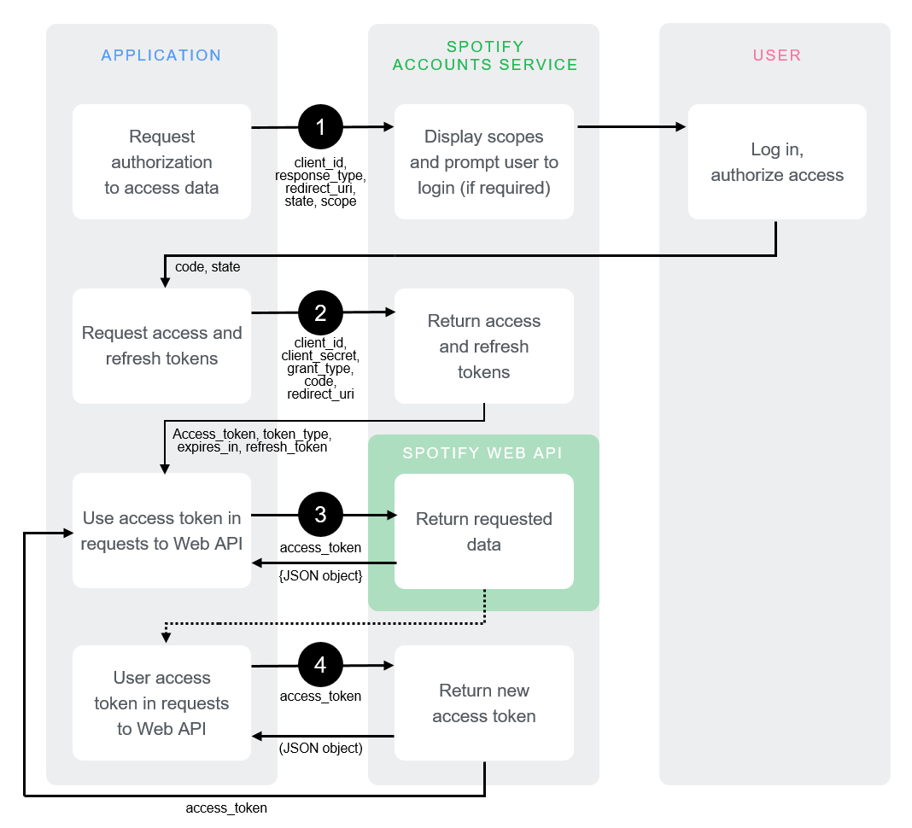

### Authorization:

1. We use client id and secret to request user's authorization for selected scopes which can be used by the app.
2. The app receives a access token in exchange of the authorization code.
3. The access token is granted by the spotify server to our app based on user's permit.
4. With the help of the access token our app can request data about the user from spotify.
   

---

### How to get access/refresh token:

1. In terminal: `npm start`
2. Go to browser at `http://127.0.0.1:8888/login`
3. As a user now grant scope permission/access
4. The application now redirects you to `http://127.0.0.1:8888/callback` where you see your access token and id.
5. You can now even get the refresh token from there itself.
6. To confirm correctness of access token do a test:

```
ACCESS_TOKEN="your_big_long_token_here"

curl -X GET "https://api.spotify.com/v1/me" -H "Authorization: Bearer $ACCESS_TOKEN"
```

---

### Building recommendation system using spotify webapi

1. Was gonna use 'get recommendation' endpoint but it is deprecated.
2. Now i'm gonna skim through user's top tracks/artists/searchHistory/recentlyPlayed to give recommendation
